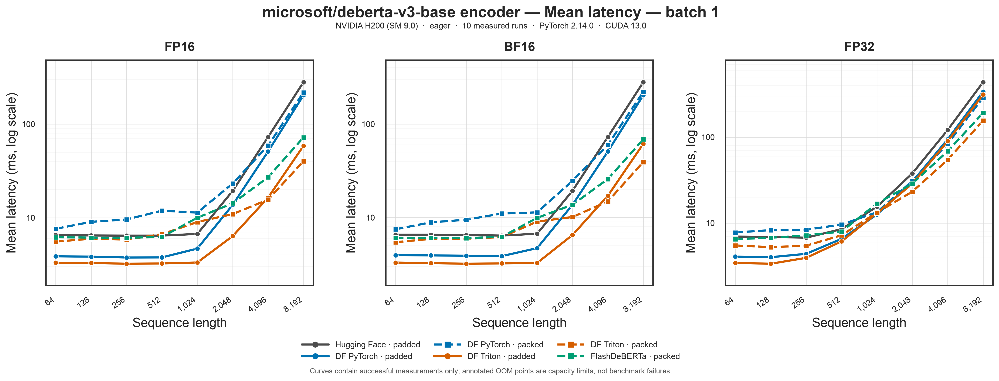
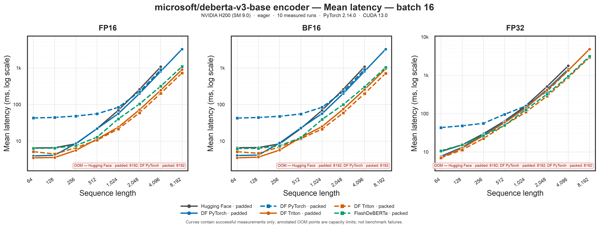
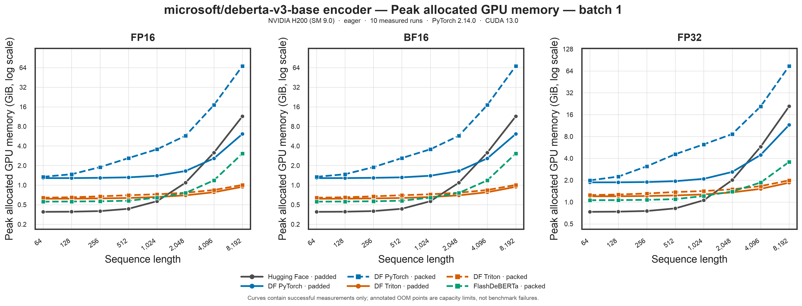
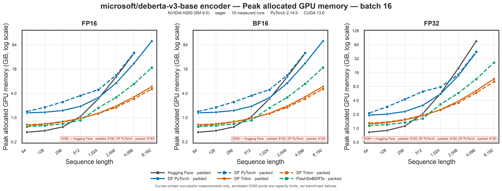

# DisentangledFlash

[](https://pypi.org/project/disentangled-flash/)
[](https://github.com/delyan-boychev/disentangled-flash/actions/workflows/ci.yml)
[](LICENSE)

***Fast exact DeBERTa-style disentangled attention in Triton.***

DisentangledFlash is an inference-oriented implementation of bidirectional
DeBERTa-v2/v3 disentangled self-attention. 

The Triton kernel is inspired by [FlashAttention](https://github.com/Dao-AILab/flash-attention)'s tiling, IO-aware computations, and online softmax without memory materialization, while its relative position encoding implementation is inspired by [FlexAttention](https://pytorch.org/blog/flexattention/). It fuses QK, relative-score lookup, factorized padding-mask application, online softmax, and PV without materializing a `[B, H, L, L]` attention tensor. C2P/P2C projection score GEMMs remain regular PyTorch GEMMs over the pruned active relative-position slots.

The PyTorch-optimized (`torch`) backend is constructed by optimizing operations, employing smart caching techniques, and leveraging fused QKV projection.


## Status

- NVIDIA CUDA + Triton
- inference only
- DeBERTa-v2/v3-style C2P/P2C disentangled attention
- FP16, BF16, strict FP32, and optional fast FP32/TF32 mode
- head dimensions 32, 64, and 128
- factorized 2-D padding masks
- runtime sequence lengths through nine bounded kernel families up to 8192
- FlashAttention-style packed, unpadded inference with `cu_seqlens`
- **fused QKV projection is always enabled** for the PyTorch/Triton backends

Training/backward is not implemented. CPU/MPS use the PyTorch backend
for development/benchmarking, not the Triton kernel.

While currently tailored to DeBERTa-v2/v3, the kernel and caching abstractions are designed to be extensible to other architectures requiring factorized relative-position or disentangled attention schemes in the future.

> [!IMPORTANT]
> **GPU compatibility**: The Triton kernel has been validated on NVIDIA RTX
> 6000 Ada (SM 8.9) and NVIDIA H200 (SM 9.0). A reviewed H200 profile for the
> exact compiler stack documented below ships in the package. Other GPUs and
> compiler stacks remain supported through bounded autotuning, but should be
> calibrated and validated locally before performance-critical deployment.
> Additional benchmark results and reviewed profiles are welcome.

## Install

Use a PyTorch build appropriate for your CUDA environment, then install this
repository editable while developing:

```bash
pip install -e ".[dev]"
```

For the pretrained Hugging Face MNLI parity benchmark:

```bash
pip install -e ".[dev,hf]"
```

`sentencepiece` and `protobuf` are included in the `hf` extra because the
DeBERTa-v2 tokenizer uses a SentencePiece `spm.model`.

## Hugging Face usage

```python
from transformers import AutoModelForSequenceClassification
from disentangled_flash import optimize_deberta

model = (
    AutoModelForSequenceClassification.from_pretrained("microsoft/deberta-v2-xlarge-mnli")
    .cuda()
    .eval()
)

optimize_deberta(
    model.deberta,
    sequence_lengths=[64, 128, 384, 512, 768, 1024, 2048, 4096, 8192],
)
```

`optimize_deberta()` replaces only the DeBERTa encoder attention path. The
existing layer output, residual, FFN, convolution, classifier, and checkpoint
parameter names are preserved.

For lower-level experiments, `enable_deberta_inference(..., backend="torch")`
selects the PyTorch backend instead of Triton.

## CUDA benchmark

Install the optional comparison backend before running the complete matrix:

```bash
pip install -e ".[benchmark]"
```

The default benchmark is a full 12-layer `microsoft/deberta-v3-base`-architecture
encoder comparison across the base implementation, DisentangledFlash's PyTorch
and Triton implementations, and FlashDeBERTa:

```bash
python -m benchmarks.benchmark_cuda \
  --output deberta_v3_base_encoder_cuda_results.json
```

It evaluates padded and packed execution at sequence lengths `64`, `128`, `256`,
`512`, `1024`, `2048`, `4096`, and `8192`. The base
encoder has no external `cu_seqlens` interface, so its packed rows are reported
as `UNSUPPORTED`, not silently substituted with padded execution. FlashDeBERTa
automatically uses its native mask-driven internal varlen path and has no switch
for a distinct dense-padded FlashDeBERTa kernel, so that implementation is
reported under packed and its padded rows are `UNSUPPORTED`. DisentangledFlash's
PyTorch and Triton implementations are measured in both modes; their packed rows
use the explicit `forward_packed` interface. Packed speedups use the matching
base padded result as the reference.

Warmup and measurement inputs never reuse tensor objects. Every iteration gets
new deterministically generated token IDs, hidden states, sequence lengths, and
masks; warmup and measurement use separate seed ranges. The same seeded samples
are shared across implementations and layouts so comparisons remain fair.
Masks use the integer dtype produced by Hugging Face tokenizers, including for
FlashDeBERTa's convolution path. Numerical parity is run outside timing with one
fresh sample at batch size 1 by default, avoiding a quadratic dense-reference
allocation proportional to a large performance batch. Both values are recorded
and can be changed with `--parity-samples` and `--parity-batch-size`.

CUDA out-of-memory conditions are capacity results, not benchmark failures. An
OOM row records the implementation, dtype, execution mode, layout, batch size,
sequence length, failure stage, exception type, and message, then the benchmark
clears the CUDA cache and continues. This is expected for the quadratic base
encoder at sufficiently long sequences. Non-OOM exceptions are recorded as
errors and make the parent command exit unsuccessfully after saving all results.

The JSON report includes a reproducibility snapshot with:

- OS, kernel, machine architecture, Python executable and version
- CPU model, host core counts, process CPU affinity, and PyTorch thread counts
- total and available host RAM plus cgroup CPU/memory limits
- Slurm job, node, task, CPU, memory, and GPU allocation fields when present
- every visible GPU's model, UUID, PCI address, compute capability, VRAM,
  multiprocessor count, clock limits, power limit, driver, and NVIDIA topology
- PyTorch CUDA build, cuDNN, PyTorch, Triton, Transformers, FlashDeBERTa, and
  DisentangledFlash versions
- git commit, branch, and dirty-worktree flag
- the full command, requested model matrix, and a safe allowlist of relevant
  CUDA/Triton/tuning environment variables

Generate report-ready latency and memory figures from the JSON output with:

```bash
python -m benchmarks.plot_cuda_results \
  deberta_v3_base_encoder_cuda_results.json \
  --output-dir benchmarks/results/deberta_v3_base_encoder
```

This writes four latency figures and four peak-allocated-memory figures, one for
each measured batch size. Every figure has separate FP16, BF16, and FP32 panels
and shows padded and packed curves together. Latency uses the recorded sample
mean (`mean_ms`); memory is the total peak CUDA allocation in GiB. Expected OOM
points are annotated and omitted from the curves, while unsupported backend and
layout combinations are not presented as measurements. PNG and vector PDF are
produced by default.

Attention-only experiments remain available explicitly (FlashDeBERTa is an
encoder implementation):

```bash
python -m benchmarks.benchmark_cuda \
  --scope attention \
  --implementations base,torch,triton \
  --layouts padded
```

To run a smaller encoder subset, override any matrix dimension:

```bash
python -m benchmarks.benchmark_cuda \
  --implementations base,triton,flashdeberta \
  --layouts padded,packed \
  --dtypes fp16 \
  --executions eager \
  --batches 1,8 \
  --lengths 64,512,2048,8192
```

### Kernel tuning profiles

The Triton backend uses a validated saved configuration when one exactly
matches the GPU, compiler stack, kernel layout, and workload. Otherwise it
safely falls back to Triton autotuning on first use. You can override that
policy explicitly:

```python
from disentangled_flash import KernelConfig, KernelTuningOptions, optimize_deberta

# Always retune, even when a bundled or personal profile matches.
optimize_deberta(model, tuning=KernelTuningOptions(mode="autotune"))

# Use a personal profile before the bundled profiles.
optimize_deberta(
    model,
    tuning=KernelTuningOptions(profile_paths=("my-gpu-profile.json",)),
)

# Advanced: bypass profiles and autotuning with one explicit configuration.
optimize_deberta(
    model,
    tuning=KernelTuningOptions(
        mode="fixed",
        fixed_config=KernelConfig(64, 64, 4),
    ),
)
```

Personal profiles placed in
`$XDG_CACHE_HOME/disentangled_flash/profiles` (or
`~/.cache/disentangled_flash/profiles`) are discovered automatically. Set
`DISENTANGLED_FLASH_PROFILE_DIR` to use another directory. Explicit profile
paths take precedence, followed by the user directory and bundled profiles.
Installed package files are never modified.

Profiles are compatible only with the exact GPU model, compute capability,
kernel version, PyTorch version, Triton compiler key, and PyTorch CUDA runtime
that produced them. The NVIDIA driver is recorded as diagnostic provenance but
does not invalidate a profile. In `auto` mode an incompatible profile is
ignored and bounded autotuning runs for workloads that are actually encountered;
`profile_only` instead reports the exact incompatibility.

The Triton autotuner specializes only on the finite length regime, head
dimension, dtype/FP32 policy, relative-attention mode, and padding-mask mode.
Exact sequence length, batch size, head count, and active-slot count are runtime
scalars and are excluded from the autotune key. Consequently, changing 384 to
383 does not trigger another benchmark sweep. Use `fixed` to bypass autotuning
entirely; `profile_only` reports a missing finite-family profile.

Generate a resumable profile on a CUDA machine with:

```bash
python -m disentangled_flash.tune \
  --preset standard \
  --output rtx-6000-ada.json
```

Inspect compatibility with the current environment using:

```bash
python -m disentangled_flash.tune inspect rtx-6000-ada.json
```

Saved profiles use nine bounded sequence-length families: `64`, `128`, `384`,
`512`, `768`, `1024`, `2048`, `4096`, and `8192`, plus occupancy families `8` and `32` batch-head
programs. Runtime lengths select the next family (for example, 383 uses the 384
profile). The exact length remains runtime data used for the launch grid, loop
bounds, and partial-tile masks. Relative-position LUTs are prepared at the
family size and indexed with a family offset, so they are reusable by every
shorter exact length in that family. Triton inputs and custom tuning sweeps are
currently capped at 8192.

This compiler-safe contract uses profile format 3. Format-2 profiles lack the
compiler fingerprint and packed-versus-padded workload identity, so they are
intentionally rejected and should be regenerated.

`quick` checks one representative workload. `standard` covers every bounded
length family, supported head dimension and dtype, both occupancy regimes, and
all relative-attention modes. It tunes separate winners for masked padded,
unmasked dense, and mixed-length packed execution. Use `--layouts` and the
other CLI options to narrow a custom run. Every accepted result is checked
against a chunked PyTorch reference with multiple mask or packed-boundary
patterns, and the output is saved after each workload so an interrupted run can
resume.

The original backend remains unfused and acts as the reference baseline. The
PyTorch and Triton backends always use one packed QKV projection.

### Packed unpadded inference

Attention modules and optimized encoders accept a FlashAttention-style packed
token layout through `forward_packed(hidden_states, cu_seqlens, max_seqlen)`.
`hidden_states` has shape `[total_tokens, hidden_size]`; `cu_seqlens` is a
contiguous int32/int64 tensor containing cumulative sequence boundaries. No
dense padded batch or cross-sequence attention matrix is constructed. The
Triton projects QKV once for the complete token buffer and dispatches one
attention grid across every sequence/head tile. Each program reads its runtime
boundaries from `cu_seqlens`, so tokens cannot attend across sequences and no
dense padded batch is created. The PyTorch backend retains a segmented reference
implementation for portability and validation.

Use `pack_padded` and `unpack_packed` to convert right-padded tensors at an API
boundary. Empty sequences and non-right-padded masks are rejected explicitly.
When both conversion directions are needed, `pack_padded_with_info` returns a
validated `PackedSequenceInfo` that can be passed as `packed_info` to
`forward_packed` and `unpack_packed`. The encoder reuses this host metadata in
every layer, avoiding repeated device synchronization:

```python
from disentangled_flash import pack_padded_with_info, unpack_packed

tokens, cu_seqlens, info = pack_padded_with_info(hidden_states, attention_mask)
packed_output = encoder.forward_packed(
    tokens,
    cu_seqlens,
    info.max_seqlen,
    packed_info=info,
).last_hidden_state
output, _ = unpack_packed(
    packed_output,
    cu_seqlens,
    hidden_states.size(1),
    packed_info=info,
)
```

## Pretrained task parity + speed

The MNLI script loads `microsoft/deberta-v2-xlarge-mnli`, compares the untouched
Hugging Face model with the same checkpoint using DisentangledFlash, verifies
logits/probabilities/hidden-state parity, and benchmarks the full classification
forward. Tokenization and model loading are excluded from timing.

Defaults are batch size 8 and 500 measured iterations:

```bash
python -m benchmarks.parity_pretrained_mnli
```

The Triton candidate uses packed `cu_seqlens` inference by default while the
untouched Hugging Face reference remains padded. Pass `--layout padded` to
benchmark the regular padded candidate path instead.

FlashDeBERTa can be selected against the same untouched checkpoint. It accepts
the padded tensors and attention mask through its regular model forward and
uses its mask-driven internal varlen path, which is reported as packed:

```bash
python -m benchmarks.parity_pretrained_mnli \
  --model microsoft/deberta-v2-xlarge-mnli \
  --backend flashdeberta \
  --layout packed
```

## Hostile CUDA validation

```bash
python -m validation.validate_cuda
```

The validation matrix covers FP16/BF16/FP32, boundary sequence lengths, several
padding patterns, and C2P/P2C position modes while reporting raw max/mean errors.

> [!NOTE]
> **Test Coverage**: CPU tests cover the public inference API, packed conversion,
> bounded tuning/profile dispatch, and launch contracts. CUDA correctness and
> performance should still be validated on every supported GPU family before
> publishing a bundled tuning profile.

## GPU calibration

The bounded families prevent retuning for every exact sequence length, but a
missing hardware/workload family still evaluates the configured candidate set
once. Offline calibration per GPU family can pre-select those configurations and
remove that first-use benchmarking cost.

Do not treat the current candidate table as a universal final table for every GPU.


## Results: H200 DeBERTa-v3-base encoder

The current benchmark covers the complete 12-layer
`microsoft/deberta-v3-base` encoder, not an isolated attention operator. It
compares the original Hugging Face encoder, DisentangledFlash's fused-QKV
PyTorch implementation, DisentangledFlash Triton, and FlashDeBERTa. The plots
and tables below intentionally report only batch sizes 1 and 16.

### Benchmark configuration

| Parameter | Value |
|---|---|
| Model | `microsoft/deberta-v3-base` architecture |
| Hidden size / heads / head dimension | 768 / 12 / 64 |
| Encoder layers / FFN size / convolution | 12 / 3072 / 3 |
| Reported batch sizes | 1, 16 |
| Sequence lengths | 64, 128, 256, 512, 1024, 2048, 4096, 8192 |
| Precisions | FP16, BF16, strict FP32 |
| Execution | Eager inference |
| Measurements | 3 warmups, 10 fresh measured inputs per point |
| Packed-length distribution | Uniform from 60% through 100% of the padded length |
| GPU | NVIDIA H200, SM 9.0, 143771 MiB VRAM |
| Driver / power limit | 595.91.07 / 700 W |
| Software | Python 3.12.14, PyTorch 2.14.0+cu130, Triton 3.8.0, cuDNN 9.2.4 |
| Comparisons | Transformers 5.17.0, FlashDeBERTa 0.0.7 |
| Host allocation | 16 CPU threads and 128 GiB RAM under Slurm |
| Host node | Intel Xeon Platinum 8568Y+, 96 physical cores, 2.16 TB RAM |
| OS | Linux 6.18.51-1-insait, x86-64, glibc 2.41 |

Each iteration uses a newly generated tensor and the same deterministic sample
for corresponding implementations. Latency is the sample mean and excludes
model preparation, compilation, and offline tuning. Peak memory is total CUDA
memory allocated, so it includes the model and persistent prepared-plan caches,
not only temporary attention workspace. OOM points are capacity observations,
not failed benchmark runs.

### Latency





Geometric-mean end-to-end speedups for packed Triton over the eight sequence
lengths are:

| Batch | Precision | vs. Hugging Face padded | vs. DF PyTorch packed | vs. FlashDeBERTa packed |
|---:|---:|---:|---:|---:|
| 1 | FP16 | **1.66×** | **2.07×** | **1.22×** |
| 1 | BF16 | **1.71×** | **2.12×** | **1.23×** |
| 1 | FP32 | **1.52×** | **1.43×** | **1.24×** |
| 16 | FP16 | **2.33×** | **5.75×** | **1.45×** |
| 16 | BF16 | **2.29×** | **5.62×** | **1.38×** |
| 16 | FP32 | **1.51×** | **2.33×** | **1.18×** |

For batch 16, comparisons against Hugging Face and packed DF PyTorch cover the
seven mutually successful lengths through 4096 because those implementations
OOM at 8192. Comparisons against FlashDeBERTa cover all eight lengths. Batch 1
comparisons cover all eight lengths.

At the longest sequence, where all packed Triton and FlashDeBERTa points
succeeded:

| Batch | Precision | DF Triton packed | FlashDeBERTa packed | Speedup | DF Triton peak | FlashDeBERTa peak | Memory reduction |
|---:|---:|---:|---:|---:|---:|---:|---:|
| 1 | FP16 | **40.13 ms** | 72.13 ms | **1.80×** | **1.01 GiB** | 3.07 GiB | **67.1%** |
| 1 | BF16 | **39.35 ms** | 68.67 ms | **1.75×** | **1.01 GiB** | 3.07 GiB | **67.1%** |
| 1 | FP32 | **155.66 ms** | 191.80 ms | **1.23×** | **1.99 GiB** | 3.57 GiB | **44.4%** |
| 16 | FP16 | **726.94 ms** | 1093.03 ms | **1.50×** | **5.13 GiB** | 17.39 GiB | **70.5%** |
| 16 | BF16 | **708.29 ms** | 1034.98 ms | **1.46×** | **5.13 GiB** | 17.39 GiB | **70.5%** |
| 16 | FP32 | **2921.89 ms** | 3116.86 ms | **1.07×** | **10.24 GiB** | 26.22 GiB | **60.9%** |

Packed execution is not automatically faster for every small workload. This
benchmark starts with padded model inputs and includes mask analysis, gathering
into a packed tensor, `cu_seqlens` construction, packed boundary bookkeeping,
and scattering back to a dense encoder output. At batch 1, that fixed cost is
not amortized until long sequences; for batch 16 FP16/BF16, packed Triton
overtakes padded Triton at length 512. Applications that keep data packed across
the surrounding pipeline avoid part of this API-boundary cost.

### Peak allocated GPU memory





At short lengths, total peak memory can make packed Triton look slightly larger
than FlashDeBERTa because DisentangledFlash retains prepared relative-position
plans and projections. For example, batch-16 FP16 at length 64 peaks at 0.664
GiB for packed Triton and 0.599 GiB for FlashDeBERTa, but the incremental
allocation above each backend's baseline is lower for Triton: 0.028 GiB versus
0.045 GiB. Once attention workspace dominates, the streaming Triton path's
lower incremental allocation also produces a substantially lower total peak,
as the length-8192 table shows.

At batch 16 and length 8192, the Hugging Face encoder OOMs in every precision;
packed DF PyTorch also OOMs in every precision, and padded DF PyTorch OOMs in
FP32. Packed and padded Triton and packed FlashDeBERTa complete all three
precisions.

### Bundled H200 tuning profile

The package includes the reviewed
[`h200-sm90-deberta-v3-base-torch-2.14-cu130-triton-3.8.json`](src/disentangled_flash/profiles/h200-sm90-deberta-v3-base-torch-2.14-cu130-triton-3.8.json)
profile. Installed wheels discover it automatically; no environment variable or
explicit profile path is required.

The profile contains 108 validated winners for the DeBERTa-v3-base workload:
head dimension 64, C2P+P2C, FP16/BF16/FP32, padded masked, padded unmasked, and
packed layouts across the nine bounded length families through 8192. It was
generated on an H200 with 10 tuning warmups and 50 repetitions per candidate.
It is intentionally a model-workload profile, not a universal H200 profile.

Profile acceptance remains strict. The bundled entries match NVIDIA H200 SM
9.0, PyTorch 2.14.0+cu130, CUDA runtime 13.0, and the recorded Triton 3.8.0
compiler fingerprint. On another compiler stack the profile is ignored in
`auto` mode and safe bounded autotuning is used instead; the NVIDIA driver is
diagnostic metadata and does not control compatibility.

### Pretrained-model parity

Task-level parity is additionally tested with the pretrained
`microsoft/deberta-v2-xlarge-mnli` checkpoint. The original Hugging Face model
and the same checkpoint with its encoder replaced by DisentangledFlash achieve
matching predictions while the test also checks classification logits,
probabilities, final hidden states, and the complete sequence-classification
path.


## Attribution

The auditable reference implementation is derived from Hugging Face Transformers
4.57.6 DeBERTa-v2/v3 modeling code and retains its original Apache-2.0 header.
See `THIRD_PARTY_NOTICES.md`.

## Citation

If you use DisentangledFlash in your research or project, please cite it as follows:

```bibtex
@software{boychev2026disentangledflash,
  author = {Boychev, Delyan},
  title = {DisentangledFlash: Fast exact DeBERTa-style disentangled attention in Triton},
  url = {https://github.com/delyan-boychev/disentangled-flash},
  version = {0.1.4},
  year = {2026}
}
```
