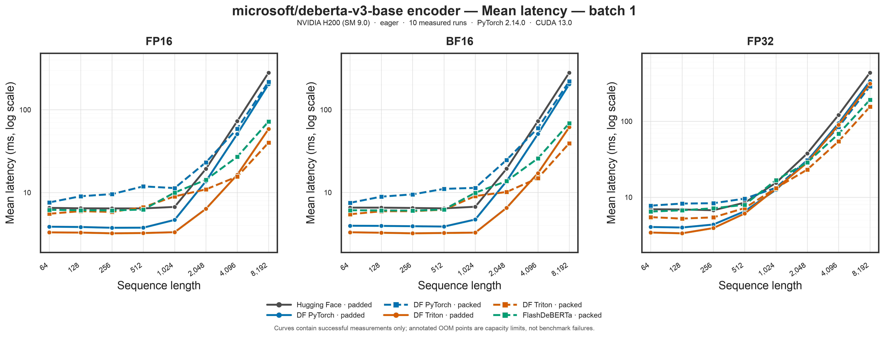
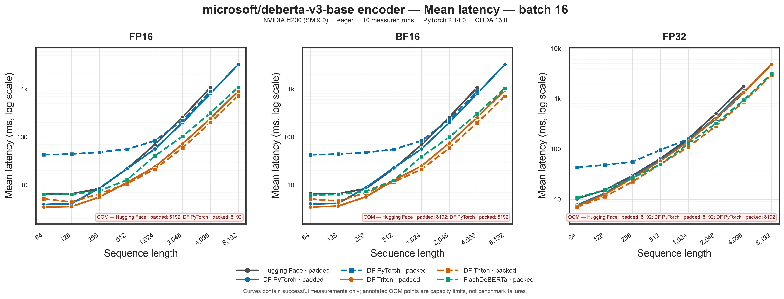
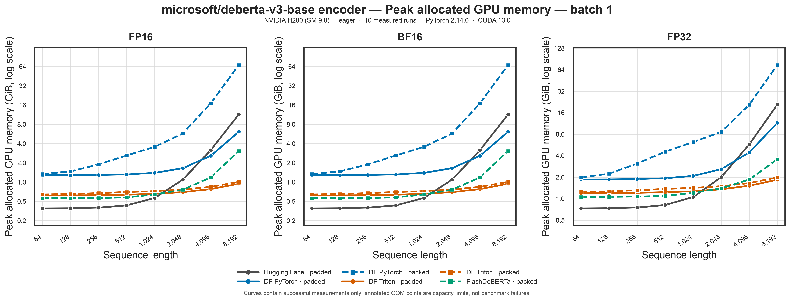
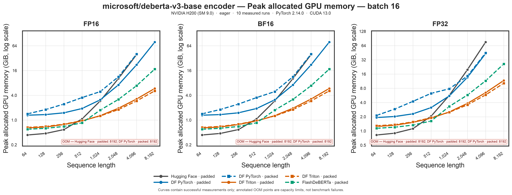

# DisentangledFlash

[](https://pypi.org/project/disentangled-flash/)
[](https://github.com/delyan-boychev/disentangled-flash/actions/workflows/ci.yml)
[](LICENSE)

***Fast exact DeBERTa-style disentangled attention in Triton.***

DisentangledFlash provides fused Triton and optimized PyTorch backends
for bidirectional DeBERTa-v2/v3 attention without materializing the
`[B, H, L, L]` attention matrix, including inference and experimental
differentiable training paths.


## Status

- NVIDIA CUDA + Triton
- inference plus experimental differentiable training/backward
- DeBERTa-v2/v3-style C2P/P2C disentangled attention
- FP16, BF16, strict FP32, and optional fast FP32/TF32 mode
- head dimensions 32, 64, and 128
- factorized 2-D padding masks
- runtime sequence lengths through nine bounded kernel families up to 8192
- FlashAttention-style packed, unpadded inference and training with `cu_seqlens`
- **fused QKV projection is always enabled** for the PyTorch/Triton backends

The training Triton path requires self-attention and head dimensions 32, 64, or
128. Attention-probability dropout (`attention_probs_dropout_prob`) runs inside
the fused kernels: like FlashAttention, the Philox mask is regenerated in the
backward pass instead of being stored. It does not yet support
`output_attentions=True` or custom pairwise relative-position tensors. CPU/MPS
use the differentiable PyTorch backend rather than Triton.

> [!IMPORTANT]
> The Triton kernel has been validated on NVIDIA RTX
> 6000 Ada (SM 8.9) and NVIDIA H200 (SM 9.0). A reviewed H200 profile for the
> documented compiler stack ships in the package. Other GPUs and stacks use
> bounded autotuning and should be validated locally.

## Install

```bash
pip install -e ".[dev]"
```

For the pretrained GLUE/MNLI evaluation:

```bash
pip install -e ".[dev,benchmark,hf]"
```

## Hugging Face usage

```python
from transformers import AutoModelForSequenceClassification
from disentangled_flash import optimize_deberta

model = (
    AutoModelForSequenceClassification.from_pretrained("microsoft/deberta-v2-xlarge-mnli")
    .cuda()
    .eval()
)

optimize_deberta(
    model.deberta,
    sequence_lengths=[64, 128, 384, 512, 768, 1024, 2048, 4096, 8192],
)
```

Only the encoder attention path is replaced; checkpoint names and the remaining
model layers are preserved. Use `enable_deberta_inference(..., backend="torch")`
to select the PyTorch backend.

For training, enable the differentiable path before constructing the optimizer:

```python
from disentangled_flash import optimize_deberta_training

optimize_deberta_training(model.deberta, backend="triton")
```

This preserves the original parameter identities and keeps Q/K/V and relative
position projections in the autograd graph. The same tuning policy applies to
training, with independently selected entries for the LSE-producing forward,
dQ, and dK/dV kernels.

## CUDA benchmark

```bash
pip install -e ".[benchmark]"
```

```bash
python -m benchmarks.benchmark_cuda \
  --output deberta_v3_base_encoder_cuda_results.json
```

The default matrix compares the full DeBERTa-v3-base encoder across Hugging
Face, DF PyTorch, DF Triton, and FlashDeBERTa at lengths 64–8192 in padded and
packed modes. It uses fresh deterministic inputs, records OOMs without stopping,
and saves hardware, software, Slurm, git, command, and environment metadata.

Generate latency and memory plots with:

```bash
python -m benchmarks.plot_cuda_results \
  deberta_v3_base_encoder_cuda_results.json \
  --output-dir benchmarks/results/deberta_v3_base_encoder
```

### Kernel tuning profiles

Matching saved profiles are used automatically; otherwise Triton runs bounded
autotuning on first use. Override this with:

```python
from disentangled_flash import (
    KernelConfig,
    KernelTuningOptions,
    optimize_deberta,
    optimize_deberta_training,
)

optimize_deberta(model, tuning=KernelTuningOptions(mode="autotune"))
optimize_deberta(
    model,
    tuning=KernelTuningOptions(profile_paths=("my-gpu-profile.json",)),
)
optimize_deberta_training(
    model,
    tuning=KernelTuningOptions(profile_paths=("my-gpu-profile.json",)),
)
optimize_deberta(
    model,
    tuning=KernelTuningOptions(
        mode="fixed",
        fixed_config=KernelConfig(64, 64, 4),
    ),
)
```

Profiles are discovered in the user cache, `DISENTANGLED_FLASH_PROFILE_DIR`, and
the package. Compatibility is keyed by GPU/compiler stack and workload; the
driver is diagnostic only. Exact length, batch size, head count, and active-slot
count are runtime values rather than autotune keys.

Generate a resumable profile on a CUDA machine with:

```bash
python -m disentangled_flash.tune \
  --output rtx-6000-ada.json
```

```bash
python -m disentangled_flash.tune inspect rtx-6000-ada.json
```

The default `standard` preset covers all supported DeBERTa-v2/v3 variants: length
families `64`, `128`, `384`, `512`, `768`, `1024`, `2048`, `4096`, and `8192`,
head dimension 64, both launch-occupancy regimes, C2P+P2C relative attention,
and padded/packed layouts. Like FlashAttention and FlexAttention, FP16 and BF16
share one half-precision schedule family (measured with BF16), while strict FP32
and fast FP32/TF32 are tuned separately over a conservative search: one pipeline
stage, forward tiles up to 64x64, and backward tiles up to 2048 elements. Training phases are tuned with and
without attention dropout, because the in-kernel mask changes register pressure.
That is 162 workload shapes, giving 162 `inference` workloads plus 972 training
workloads (`training_forward`, `backward_dq`, and `backward_dkv` for both dropout
variants), 1134 phase workloads in total. Results are parity-checked and saved after each workload so tuning can
resume. `--passes inference`, `--passes training`, or `--dropout off|on` can
restrict a run; the shape and attention options remain available for custom
architectures.

### Packed unpadded inference and training

`forward_packed(hidden_states, cu_seqlens, max_seqlen)` accepts
FlashAttention-style `[total_tokens, hidden_size]` input. Convert right-padded
input with `pack_padded_with_info` and reuse its metadata across encoder layers:

```python
from disentangled_flash import pack_padded_with_info, unpack_packed

tokens, cu_seqlens, info = pack_padded_with_info(hidden_states, attention_mask)
packed_output = encoder.forward_packed(
    tokens,
    cu_seqlens,
    info.max_seqlen,
    packed_info=info,
).last_hidden_state
output, _ = unpack_packed(
    packed_output,
    cu_seqlens,
    hidden_states.size(1),
    packed_info=info,
)
```

The same call is differentiable when the encoder was installed with
`optimize_deberta_training`; no padded `[B, L, ...]` attention workspace is
created by the packed Triton path.

## Pretrained GLUE/MNLI evaluation

```bash
python -m benchmarks.evaluate_mnli
```

This runs one cold, full GLUE/MNLI matched-validation pass at batch size 8 across
Hugging Face, DF PyTorch, DF Triton, and FlashDeBERTa. It reports performance,
accuracy, numerical error, and classification-decision parity.

To require the bundled H200 configuration and prohibit Triton autotuning:

```bash
python -m benchmarks.evaluate_mnli \
  --tuning-mode profile_only \
  --profile src/disentangled_flash/profiles/h200-sm90-deberta-v2-v3-torch-2.14-cu130-triton-3.8.json
```

## CUDA validation

```bash
python -m validation.validate_cuda
```

Run this before publishing a profile for a new GPU or compiler stack.


## Results: H200 DeBERTa-v3-base encoder









These H200 results cover the complete 12-layer DeBERTa-v3-base encoder and
report batch sizes 1 and 16.

### Benchmark configuration

| Parameter | Value |
|---|---|
| Model | `microsoft/deberta-v3-base` architecture |
| Reported batch sizes | 1, 16 |
| Sequence lengths | 64, 128, 256, 512, 1024, 2048, 4096, 8192 |
| Precisions | FP16, BF16, strict FP32 |
| Execution / measurements | Eager; 3 warmups and 10 fresh inputs per point |
| Packed-length distribution | Uniform from 60% through 100% of the padded length |
| GPU | NVIDIA H200, SM 9.0, 143771 MiB VRAM |
| Driver / power limit | 595.91.07 / 700 W |
| Software | Python 3.12.14, PyTorch 2.14.0+cu130, Triton 3.8.0, cuDNN 9.2.4 |
| Comparisons | Transformers 5.17.0, FlashDeBERTa 0.0.7 |
| Host allocation | 16 CPU threads and 128 GiB RAM under Slurm |
| Host / OS | Xeon Platinum 8568Y+; Linux 6.18.51-1-insait, x86-64, glibc 2.41 |

Latency is the sample mean and excludes preparation, compilation, and offline
tuning. Peak memory is total CUDA allocation. Corresponding implementations use
the same deterministic samples; OOM points are capacity results.

### Latency

Geometric-mean packed-Triton speedups across the eight sequence lengths:

| Batch | Precision | vs. Hugging Face padded | vs. DF PyTorch packed | vs. FlashDeBERTa packed |
|---:|---:|---:|---:|---:|
| 1 | FP16 | **1.66×** | **2.07×** | **1.22×** |
| 1 | BF16 | **1.71×** | **2.12×** | **1.23×** |
| 1 | FP32 | **1.52×** | **1.43×** | **1.24×** |
| 16 | FP16 | **2.33×** | **5.75×** | **1.45×** |
| 16 | BF16 | **2.29×** | **5.62×** | **1.38×** |
| 16 | FP32 | **1.51×** | **2.33×** | **1.18×** |

Batch-16 Hugging Face and DF PyTorch comparisons stop at 4096 because both OOM
at 8192. The following table compares successful length-8192 points:

| Batch | Precision | DF Triton packed | FlashDeBERTa packed | Speedup | DF Triton peak | FlashDeBERTa peak | Memory reduction |
|---:|---:|---:|---:|---:|---:|---:|---:|
| 1 | FP16 | **40.13 ms** | 72.13 ms | **1.80×** | **1.01 GiB** | 3.07 GiB | **67.1%** |
| 1 | BF16 | **39.35 ms** | 68.67 ms | **1.75×** | **1.01 GiB** | 3.07 GiB | **67.1%** |
| 1 | FP32 | **155.66 ms** | 191.80 ms | **1.23×** | **1.99 GiB** | 3.57 GiB | **44.4%** |
| 16 | FP16 | **726.94 ms** | 1093.03 ms | **1.50×** | **5.13 GiB** | 17.39 GiB | **70.5%** |
| 16 | BF16 | **708.29 ms** | 1034.98 ms | **1.46×** | **5.13 GiB** | 17.39 GiB | **70.5%** |
| 16 | FP32 | **2921.89 ms** | 3116.86 ms | **1.07×** | **10.24 GiB** | 26.22 GiB | **60.9%** |

Packing conversion has a fixed cost; at batch 16 FP16/BF16, packed Triton
overtakes padded Triton at length 512.

### Peak allocated GPU memory

At batch 16 and length 8192, Hugging Face and packed DF PyTorch OOM in every
precision; padded DF PyTorch OOMs in FP32. Both Triton layouts and FlashDeBERTa
complete all three precisions.

### Bundled H200 tuning profile

The package automatically discovers the reviewed
[`h200-sm90-deberta-v2-v3-torch-2.14-cu130-triton-3.8.json`](src/disentangled_flash/profiles/h200-sm90-deberta-v2-v3-torch-2.14-cu130-triton-3.8.json)
profile. Its 1,134 winners cover inference, training forward, and both backward
phases across the standard DeBERTa-v2/v3 workload families through length 8192.
They require H200 SM 9.0, PyTorch 2.14.0+cu130,
CUDA 13.0, and the recorded Triton 3.8.0 compiler fingerprint; otherwise `auto`
mode uses bounded autotuning.

### Pretrained-model parity

The H200 task-level test uses `microsoft/deberta-v2-xlarge-mnli`, FP16, batch 16,
length 512, and one cold pass over all 9,815 matched-validation examples. The
dense input is **92.62% padding**. Every implementation reaches **91.7371%
accuracy** with full decision parity (**0/9,815 mismatches**).

| Implementation | Time | Throughput | Speedup vs. HF | Decision mismatches | Logit abs. error max / mean | Probability abs. error max / mean |
|---|---:|---:|---:|---:|---:|---:|
| Hugging Face padded | 55,963.399 ms | 175.38 examples/s | 1.00× | 0 / 9,815 | 0 / 0 | 0 / 0 |
| DF PyTorch padded | 53,484.569 ms | 183.51 examples/s | 1.05× | 0 / 9,815 | 0.109375 / 0.00126508 | 0.0100614 / 0.00008926 |
| DF Triton padded | 31,329.634 ms | 313.28 examples/s | 1.79× | 0 / 9,815 | 0.0742188 / 0.00114972 | 0.00796831 / 0.00008365 |
| **DF Triton packed** | **5,419.671 ms** | **1,811.00 examples/s** | **10.33×** | **0 / 9,815** | 0.0507812 / 0.00113259 | 0.00853068 / 0.00008150 |
| FlashDeBERTa packed | 22,058.000 ms | 444.96 examples/s | 2.54× | 0 / 9,815 | 0.0800781 / 0.00115263 | 0.00675502 / 0.00008179 |

Packed Triton is **4.07× faster than FlashDeBERTa** here. Error columns report
full-dataset maximum and mean absolute error; one pass provides no run-to-run
standard deviation.


## Attribution

The auditable reference implementation is derived from Hugging Face Transformers
4.57.6 DeBERTa-v2/v3 modeling code and retains its original Apache-2.0 header.
See `THIRD_PARTY_NOTICES.md`.

## Citation

If you use DisentangledFlash in your research or project, please cite it as follows:

```bibtex
@software{boychev2026disentangledflash,
  author = {Boychev, Delyan},
  title = {DisentangledFlash: Fast exact DeBERTa-style disentangled attention in Triton},
  url = {https://github.com/delyan-boychev/disentangled-flash},
  version = {0.2.0},
  year = {2026}
}
```
