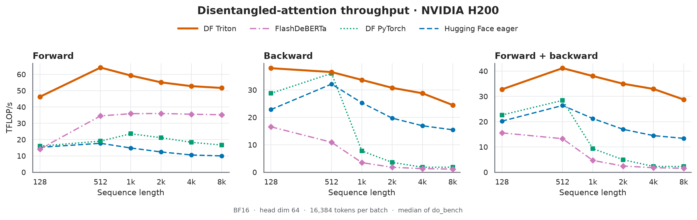
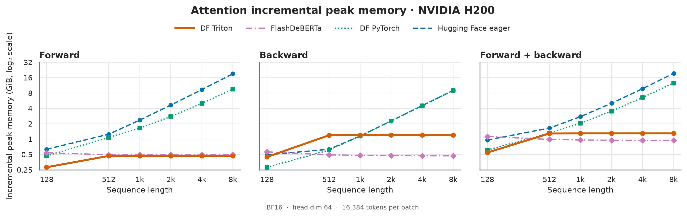
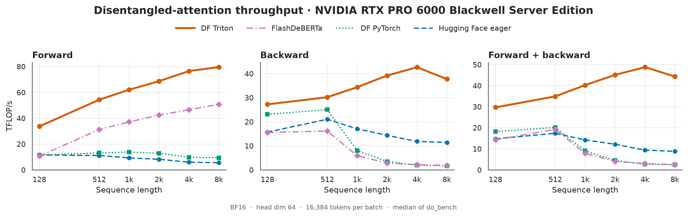
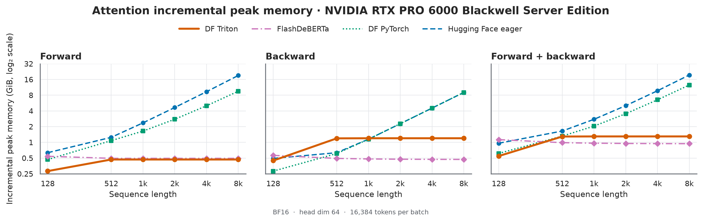
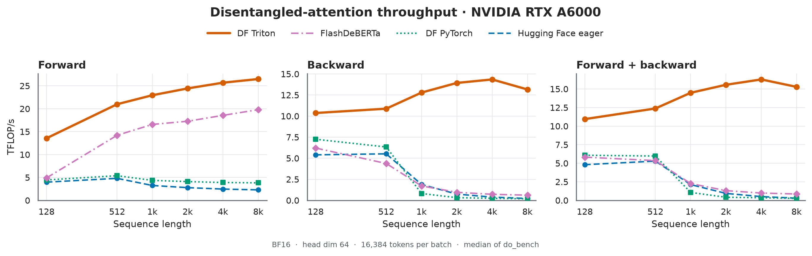
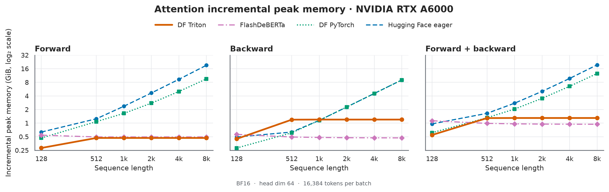

# DisentangledFlash

[](https://pypi.org/project/disentangled-flash/)
[](https://github.com/delyan-boychev/disentangled-flash/actions/workflows/ci.yml)
[](LICENSE)

***Fast exact DeBERTa-style disentangled attention in Triton.***

DisentangledFlash provides fused Triton and optimized PyTorch backends
for bidirectional DeBERTa-v2/v3 attention without materializing the
`[B, H, L, L]` attention matrix, including inference and experimental
differentiable training paths.


## Status

- NVIDIA CUDA + Triton
- inference plus experimental differentiable training/backward
- DeBERTa-v2/v3-style C2P/P2C disentangled attention
- FP16, BF16, strict FP32, and optional fast FP32/TF32 mode
- head dimensions 32, 64, and 128
- factorized 2-D padding masks
- runtime sequence lengths through nine bounded kernel families up to 8192
- FlashAttention-style packed, unpadded inference and training with `cu_seqlens`
- **fused QKV projection is always enabled** for the PyTorch/Triton backends

The training Triton path requires self-attention and head dimensions 32, 64, or
128. Attention-probability dropout (`attention_probs_dropout_prob`) runs inside
the fused kernels: like FlashAttention, the Philox mask is regenerated in the
backward pass instead of being stored. It does not yet support
`output_attentions=True` or custom pairwise relative-position tensors. CPU/MPS
use the differentiable PyTorch backend rather than Triton.

> [!IMPORTANT]
> The Triton kernel has been validated on NVIDIA RTX A6000 (SM86), RTX 6000 Ada
> (SM89), H200 (SM90), and RTX PRO 6000 Blackwell (SM120). A reviewed H200
> profile ships in the package; other GPUs use the portable heuristic and
> should be validated locally.

## Install

```bash
pip install -e ".[dev]"
```

For the pretrained GLUE/MNLI evaluation:

```bash
pip install -e ".[dev,benchmark,hf]"
```

## Hugging Face usage

```python
from transformers import AutoModelForSequenceClassification
from disentangled_flash import optimize_deberta

model = (
    AutoModelForSequenceClassification.from_pretrained("microsoft/deberta-v2-xlarge-mnli")
    .cuda()
    .eval()
)

optimize_deberta(
    model.deberta,
    sequence_lengths=[64, 128, 384, 512, 768, 1024, 2048, 4096, 8192],
)
```

Only the encoder attention path is replaced; checkpoint names and the remaining
model layers are preserved. Use `enable_deberta_inference(..., backend="torch")`
to select the PyTorch backend.

For training, enable the differentiable path before constructing the optimizer:

```python
from disentangled_flash import optimize_deberta_training

optimize_deberta_training(model.deberta, backend="triton")
```

This preserves the original parameter identities and keeps Q/K/V and relative
position projections in the autograd graph. The same tuning policy applies to
training, with independently selected entries for the LSE-producing forward,
dQ, and dK/dV kernels.

## Performance

These are BF16 attention-layer results with 12 heads, head dimension 64,
16,384 active tokens per batch, and no dropout. All backends compute exact
DeBERTa C2P/P2C attention. DF Triton uses the built-in heuristic, not a tuned
profile.

These runs used PyTorch 2.14.0+cu130, Triton 3.8.0, CUDA 13.0, Transformers
5.18.0, and FlashDeBERTa 0.0.7.

TFLOP/s is FLOPs divided by time. For batch `B`, heads `H`, length `L`, head
dimension `D`, and `R` active relative-position rows, we count
`BH(4L²D + 4LRD)` for forward, `BH(10L²D + 12LRD)` for backward, and
`BH(14L²D + 16LRD)` combined. As in FlashAttention, this excludes softmax,
gathers, and projection layers.

The forward count comes from two dense matrix products, QK and PV
(`2L²D` each), plus C2P and P2C (`2LRD` each). Backward recomputes the score
products and forms gradients for both operands: `10L²D` for QK/PV and `12LRD`
for C2P/P2C. Forward + backward is their sum.

### Length-8192 summary

| GPU | Pass | DF Triton latency | vs. Hugging Face | vs. FlashDeBERTa | DF peak memory |
| --- | --- | ---: | ---: | ---: | ---: |
| **H200** | Forward | 8.48 ms | 5.18× | 1.47× | 0.47 GiB |
|  | Backward | 45.26 ms | 1.58× | 21.88× | 1.20 GiB |
|  | Forward + backward | 53.80 ms | 2.15× | 18.62× | 1.30 GiB |
| **RTX PRO 6000 Blackwell** | Forward | 5.50 ms | 14.44× | 1.57× | 0.47 GiB |
|  | Backward | 29.35 ms | 3.32× | 20.59× | 1.20 GiB |
|  | Forward + backward | 34.88 ms | 5.04× | 17.62× | 1.30 GiB |
| **RTX A6000** | Forward | 16.54 ms | 11.55× | 1.34× | 0.47 GiB |
|  | Backward | 84.20 ms | 58.59× | 21.27× | 1.20 GiB |
|  | Forward + backward | 101.17 ms | 51.32× | 17.83× | 1.30 GiB |

All 72 cases per GPU completed without allocator retries or `cudaMalloc` calls
during timing.

### Full curves

#### NVIDIA H200





#### NVIDIA RTX PRO 6000 Blackwell





#### NVIDIA RTX A6000





Short backward cases are sensitive to Python, autograd, and launch overhead;
on H200 this dominates the length-128 backward measurements. Longer sequences
are GPU-compute dominated. The plots show measured eager throughput without a
separate host-bound marker.

### Benchmark methodology

Install the benchmark dependencies and reproduce the matrix and plots with:

```bash
pip install -e ".[benchmark]"
python -m benchmarks.benchmark_cuda --tuning-mode heuristic --output attention_kernel_results.json
python -m benchmarks.plot_cuda_results attention_kernel_results.json --output-dir docs/figures
```

Pass `--tuning-mode profile_only --profile PROFILE.json` to benchmark a tuned
profile instead; it fails on any workload the profile does not cover.

Each configuration runs in its own process. After one untimed call for
compilation and setup, Triton's `do_bench` uses 3 ms of warmup and 30 ms of
timing, flushing L2 before each iteration; processes are separated by one
second. Backward is timed independently by running forward once and replaying
`out.backward(grad, retain_graph=True)`.

Timing is eager and includes Python, autograd, and launch overhead. The Hugging
Face mask and relative-position matrix are constructed before timing. The
report also records min, p10, median, and p90 latency, incremental peak memory,
allocator retries, and `cudaMalloc` calls.

### Kernel tuning profiles

A matching profile is used automatically; otherwise the kernel uses a
hardware-aware heuristic. `heuristic` always ignores profiles, `profile_only`
fails on a miss, and `autotune` benchmarks candidates at runtime.

```python
from disentangled_flash import KernelTuningOptions, optimize_deberta

optimize_deberta(model, tuning=KernelTuningOptions(mode="heuristic"))
```

Generate and inspect a profile with:

```bash
python -m disentangled_flash.tune --output my-gpu.json
python -m disentangled_flash.tune inspect my-gpu.json
```

The default preset tests the heuristic and nearby configs. Release profiles use
`--preset exhaustive`. Runs are parity-checked, resumable, and saved after each
workload.

### Packed unpadded inference and training

`forward_packed(hidden_states, cu_seqlens, max_seqlen)` accepts
FlashAttention-style `[total_tokens, hidden_size]` input. Convert right-padded
input with `pack_padded_with_info` and reuse its metadata across encoder layers:

```python
from disentangled_flash import pack_padded_with_info, unpack_packed

tokens, cu_seqlens, info = pack_padded_with_info(hidden_states, attention_mask)
packed_output = encoder.forward_packed(
    tokens,
    cu_seqlens,
    info.max_seqlen,
    packed_info=info,
).last_hidden_state
output, _ = unpack_packed(
    packed_output,
    cu_seqlens,
    hidden_states.size(1),
    packed_info=info,
)
```

The same call is differentiable when the encoder was installed with
`optimize_deberta_training`; no padded `[B, L, ...]` attention workspace is
created by the packed Triton path.

## Pretrained GLUE/MNLI evaluation

```bash
python -m benchmarks.evaluate_mnli
```

This runs one cold matched-validation pass and reports speed, accuracy, and
decision parity. The release command is:

```bash
python -m benchmarks.evaluate_mnli \
  --dtype fp16 \
  --batch-size 8 \
  --bucket 512 \
  --require-full-parity \
  --tuning-mode heuristic \
  --output mnli_parity_fp16_heuristic.json
```

On the full 9,815-example FP16 split at batch size 8, every row below reached
91.74% accuracy with zero decision mismatches against Hugging Face.

| GPU | Variant | Cold time | Compiled-cache time | Cold speedup | Compiled speedup |
| --- | --- | ---: | ---: | ---: | ---: |
| **H200** | Hugging Face eager, padded | 55.49 s | 55.70 s | 1.00× | 1.00× |
|  | DF Triton, padded | 24.24 s | 23.38 s | 2.29× | 2.38× |
|  | **DF Triton, packed** | **11.52 s** | **9.99 s** | **4.82×** | **5.58×** |
|  | FlashDeBERTa, packed | 24.41 s | 23.99 s | 2.27× | 2.32× |
| **RTX PRO 6000 Blackwell** | Hugging Face eager, padded | 88.85 s | 88.67 s | 1.00× | 1.00× |
|  | DF Triton, padded | 38.96 s | 37.50 s | 2.28× | 2.36× |
|  | **DF Triton, packed** | **8.28 s** | **7.33 s** | **10.73×** | **12.10×** |
|  | FlashDeBERTa, packed | 39.16 s | 38.86 s | 2.27× | 2.28× |
| **RTX A6000** | Hugging Face eager, padded | 235.63 s | 236.12 s | 1.00× | 1.00× |
|  | DF Triton, padded | 112.38 s | 111.46 s | 2.10× | 2.12× |
|  | **DF Triton, packed** | **18.64 s** | **16.37 s** | **12.64×** | **14.42×** |
|  | FlashDeBERTa, packed | 112.37 s | 112.08 s | 2.10× | 2.11× |

Cold timings include JIT compilation; compiled-cache timings come from a new
process reusing those binaries. `heuristic` skips configuration search, not
compilation. Put `TRITON_CACHE_DIR` on fast persistent storage: cold runs write
artifacts and later processes read them before the first iteration, so slow
cache I/O can dominate startup. These differences also include normal
run-to-run variation.

This is decision parity, not bitwise logit equality. The recorded BF16 run did
not meet full decision parity, so the release claim uses FP16.

## CUDA validation

```bash
python -m validation.validate_cuda
```

Run this before publishing a profile for a new GPU or compiler stack.

## Bundled H200 tuning profile

The package automatically discovers the reviewed
[`h200-sm90-deberta-v2-v3-torch-2.14-cu130-triton-3.8.json`](src/disentangled_flash/profiles/h200-sm90-deberta-v2-v3-torch-2.14-cu130-triton-3.8.json)
profile. Its 1,134 validated winners cover inference, training forward, and both
backward phases across the standard DeBERTa-v2/v3 workload families through
length 8192. They require H200 SM 9.0, PyTorch 2.14.0+cu130, CUDA 13.0, and
the recorded Triton 3.8.0 compiler fingerprint; otherwise `auto` mode uses
the heuristic.

## Release parity checks

Release validation consists of the full MNLI matched-validation decision-parity
run above and a short BF16 fine-tuning comparison with attention dropout 0.1:

```bash
python -m validation.validate_multistep_training \
  --dropout 0.1 \
  --require-parity \
  --tuning-mode profile_only \
  --profile src/disentangled_flash/profiles/h200-sm90-deberta-v2-v3-torch-2.14-cu130-triton-3.8.json
```

The 12-layer BF16 check runs 20 optimizer steps at length 1024, batch 2, and
dropout 0.1. Final fixed loss differed by 0.0796%; final parameter relative L2
difference was 0.42% with cosine similarity 0.99999. It validates the training
path, including backward, but does not claim elementwise-identical gradients.

## Attribution

The auditable reference implementation is derived from Hugging Face Transformers
4.57.6 DeBERTa-v2/v3 modeling code and retains its original Apache-2.0 header.
See `THIRD_PARTY_NOTICES.md`.

## Citation

If you use DisentangledFlash in your research or project, please cite it as follows:

```bibtex
@software{boychev2026disentangledflash,
  author = {Boychev, Delyan},
  title = {DisentangledFlash: Fast exact DeBERTa-style disentangled attention in Triton},
  url = {https://github.com/delyan-boychev/disentangled-flash},
  version = {1.1.0},
  year = {2026}
}
```
